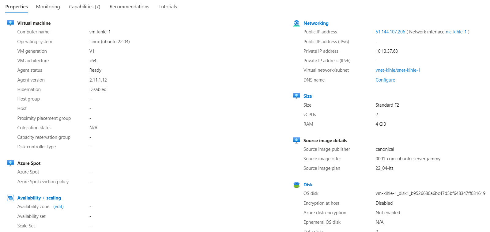

# OperaTerra AS

> Frederick Kihle - Junior IT consultant

## Terraform Commands - How to set it up

### Command: terraform init

The terraform init command initializes a working directory containing configuration files and installs plugins for required providers.

Run the following command in the root folder to initiate the terraform project:

```
terraform init
```


### Command: terraform validate

The terraform validate command validates the configuration files in a directory, referring only to the configuration and not accessing any remote services such as remote state, provider APIs, etc.

Run the following command to check the configuration files for errors:

```
terraform validate
```


### Command: terraform plan

The terraform plan command creates an execution plan, which lets you preview the changes that Terraform plans to make to your infrastructure.

Run the following command to see which changes will be made (speculative plan - useful for checks during development):

```
terraform plan
```

By default, when Terraform creates a plan it reads the current state of any already-existing remote objects to make sure that the Terraform state is up-to-date. If the project already exists it Terraform will look for differences between the local codebase and the deployed resources and apply changes to the deployed resources to reflect the updated codebase. If nothing has been deployed yet, everything will be created.

You can use the optional -out=FILENAME option to save the generated plan to a file on disk, which you can later execute by passing the file to ```terraform apply``` as an extra argument.

Run the following command to see which changes will be made (final non-speculative plan - use this prior to deployment):

```
terraform plan -out="your_filename_here.tfplan"
```


### Command: terraform apply

The terraform apply command executes the actions proposed in a Terraform plan to create, update, or destroy infrastructure.

Run the following command to set the wheels in motion:

```
terraform apply "your_filename_here.tfplan"
```

### Command: terraform destroy

The terraform destroy command is a convenient way to destroy all remote objects managed by a particular Terraform configuration.

Run the following command to tear it all down (and save money):

```
terraform destroy
```

**Use this command carefully, there is no turning back!**

---


## Modules - What's in this project

The project is split into modules based on resource types. This helps maintain a developers sanity when juggling a project above a certain size.

The root module uses these child modules to collect all the configurations nessesary to complete the project requirements.


### - Network Module

The Network module has a Virtual Network (VNET), a Network Security Group (NSG), and creates the amount of subnets defined in the ```terraform.tfvars``` file. Network Interface Card (NIC) are created for each VM defined in the ```terraform.tfvars``` file to provide network connections to the VMs. 

#### Output 

The Network module outputs the Network Interface Card IDs for use in the Virtual Machine module.


### - Virtual Machine Module

The Virtual Machine module creates Virtual Machines based in ```vm_names``` input from the ```terraform.tfvars``` file. The module gives the VMs project related names, each VM is given a NIC (created in the Network module) and a unique username and password for admin login (created in the Key Vault module).

The Virtual Machine module is dependent on the Key Vault module for the username and password. This is specified in the root ```main.tf``` file.

#### Output

None.


### - Key Vault Module

The Key Vault module creates a Key Vault to manage the following secrets: 
- **Storage Account Accesskey [kv-sa-accesskey]**: Used for storage account authentication. 
- **Virtual Machine Username [kv-vm-username]**: VM admin usernames
- **Virtual Machine Password [kv-vm-password]**: VM admin passwords

#### Output

The Key Vault module outputs the usernames and passwords for the VMs. The outputs are marked as sensitive.


### - Storage Account Module

The Storage Account module creates a Storage Account and a private Storage Container. 

#### Output

The Storage Account module outputs a Storage Account Access Key name ```[sa_accesskey_name]``` and a Storage Account Access Key value ```[sa_accesskey_value]``` for the Key Vault module to store as secrets. This outputs is marked as sensitive. 

---


## Dependencies 

- hashicorp/azurerm

---


## terraform.tfvars file - You'll want to read this!

To be able to plan and apply the code, you need a `terraform.tfvars` file. The ```terraform.tfvars``` file is where you add your project-specific customization. The file should be placed in the root folder. Below is an example of how this file can look. Some of the variables below have default values as a fallback but not all. I advise filling out all variables to avoid confusion or resource creation errors. These are the variables used for each module:

```tfvars

# Azure subscription ID
subscription_id = "01234567-89ab-cdef-1234-56789abcdef0"

# Common tags
company_name = "Opera Terra AS"
costcenter   = "utvikling-001"
project_name = "oblig1"
environment  = "dev"

# Resource Group
location = "westeurope"

# Network
vnet_range = "10.13.37.0/24"
subnet_ranges = [
  "10.13.37.0/26",
  "10.13.37.64/26",
  "10.13.37.128/26",
  "10.13.37.192/26"
]

# Virtual Machine
vm_names = [
  "server-01",
  "server-02",
  "server-03"
]

```

---


## Demo - Let's see if I got this right 

This section is a project deployment demo. What follows is a series of screenshots accompanied with short explainations.

**Fingers crossed**

### 1. Create a plan

At this point I'm finished with all the fancy formating ```terraform fmt``` (formats the code for readability) and validation ```terraform validate``` (check for "offline" errors in the codebase).

Open the terminal in the root folder and execute the following command:
```
terraform plan -out="oblig1.tfplan"
```

Screenshot:


Let's have a look at the **sensitive** values to doublecheck that they are not visible:


Excellent, moving on.

### 2. Apply the plan

You'll want to grab a cup of coffee for this stage as it might take a little while or you could time this to coincide with a bathroom break.

Execute the following command:
```
terraform apply "oblig1.tfplan"
```

Screenshot (in progress):


Screenshot (complete):


### 3. Let's see what has been created

Let's head over to the Azure Portal to see what we've just created. I'm not showing every single detail but here comes a selection.

#### Overview


#### Storage Container
*This took me a while to find, and for a while I thought that the container wasn't created.*


#### Overview of one of the VMs



#### Overview of the Subnets


#### Resource visualizer
*In the left menu in the main resource group you can find the option: Resource visualizer.*


---

Resources used in the creation of this project:
- https://developer.hashicorp.com/terraform/language/meta-arguments/count
- https://learn.microsoft.com/en-us/azure/virtual-machines/linux/quick-create-terraform?tabs=azure-cli
- https://github.com/Azure/terraform-azurerm-network-security-group/blob/main/README.md
- https://github.com/Azure/terraform-azurerm-network-security-group/blob/main/README.md#input_predefined_rules
- https://registry.terraform.io/providers/hashicorp/azurerm/latest/docs/resources/storage_account
- https://registry.terraform.io/providers/hashicorp/azurerm/latest/docs/resources/key_vault
- https://www.crayon.com/pl/resources/insights/manage-your-secrets-with-terraform-and-azure-key-vault/
- https://learn.microsoft.com/en-us/azure/key-vault/keys/quick-create-terraform?tabs=azure-cli
- Lecture videos (in particular the one below)
  - https://www.youtube.com/watch?v=t4do452EtqY
- ChatGPT (last resort help for solving issues when not figuring it out myself)